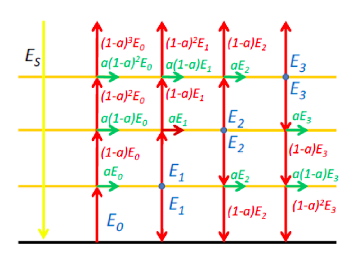

# Problema 1
Um painel solar térmico (superfície negra ideal) possui 3 vidros completamente transparentes para a radiação solar, e com absorvidade a para a radiação infravermelha. A Figura 1 mostra o diagrama de fluxos radiativos desse painel.

Admitindo que o sistema encontra-se em equilíbrio radiativo (não existindo outros fluxos de energia para o exterior), e que os fluxos de radiação infravermelha emitida (E0, E1, E2, E3) satisfazem o sistema de 4 equações:

calcule os fluxos emitidos pelas 4 superfícies, resolvendo o sistema de equações para o caso a=0.8, E_S=500Wm^-2. 

O sistema de equações lineares deve ser resolvido utilizando o método de Eliminação Gaussiana, sem e com pivotamento. 
